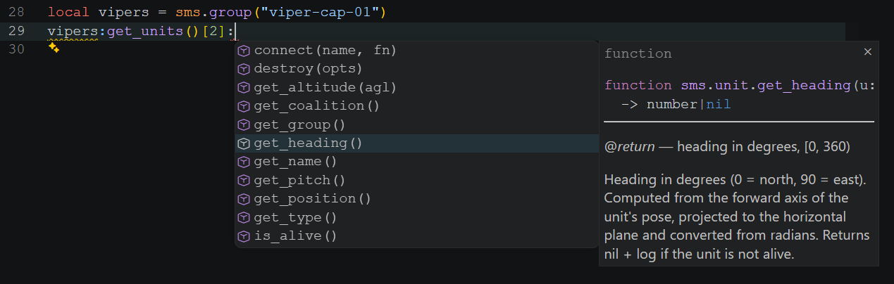
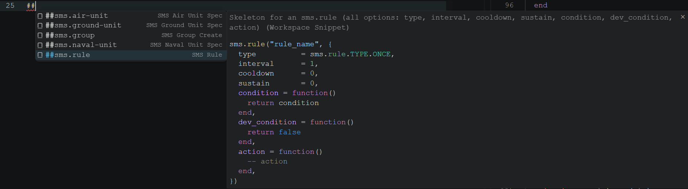

<p align="center">
  
</p>

# dcs-sms — framework

In-DCS Lua scripting framework. Loaded once per mission; everything else is the `sms.*` namespace.

> **⚠️ Work in progress — not ready for real missions.**
> The framework is in active development; the public surface is still in flux and breaking changes land between minor versions. Don't build a mission against `sms.*` yet — symbols, options-table keys, and module names will move under you. Try it for experiments, file issues, but expect to rewrite anything you author here once the surface stabilises.

## Audience

You write `.lua` mission scripts that run inside DCS World. You want a smaller, focused alternative to MOOSE — fewer abstractions, no inheritance, every public symbol documented with a runnable example.

## Install

Load the framework once per mission. From a mission script (Triggers → Do Script File or `dofile` from your own loader):

```lua
dofile("D:/git/dcs-sms/framework/load_all.lua")
-- sms is now available globally
sms.log.info("framework version " .. sms.version)
```

Or via the host-side bridge (see [`tools/cmd/dcs-sms/README.md`](../tools/cmd/dcs-sms/README.md)):

```sh
dcs-sms.exe exec --file framework/load_all.lua
```

## First taste

```lua
local cap = sms.group.create({
  name     = "f18-cap",
  position = {x = 0, y = 0, z = 0},
  country  = sms.K.countries.USA,
  category = sms.K.category.AIRPLANE,
  units    = { {type = sms.K.units.planes.FA_18C_hornet, alt = 6000, heading = 90} },
})

local orbit_task = sms.task.orbit({x = 50000, y = 0, z = 0}, {
  altitude = 6000, speed = 200, pattern = "Circle",
})
cap:set_task(orbit_task)

cap:connect(sms.events.DEAD, function(evt)
  sms.log.info("CAP wiped at " .. evt.time)
end)
```

## Editor support

Every public `sms.*` symbol is type-annotated (EmmyLua / lua-language-server). With VSCode's [Lua extension](https://marketplace.visualstudio.com/items?itemName=sumneko.lua), autocomplete works the whole way down — through chained calls, indexed lookups, and option-table keys — with the inline signature and the full doc comment.

For example, `vipers:get_units()[2]:` correctly resolves to `sms.unit` and offers every unit method:

<p align="center">
  
</p>

The repo also ships workspace snippets at [`.vscode/sms.code-snippets`](../.vscode/sms.code-snippets) — ready-made skeletons for the patterns you write most often (groups, units, statics, rules). Type `##` to open the menu:

<p align="center">
  
</p>

The same type annotations and worked-example docs that drive editor autocomplete also make the framework well-suited for AI coding assistants (Cursor, Copilot, Claude Code). A narrow public surface, a predictable `log + nil` failure model, per-module reference pages under [`docs/api/`](../docs/api/), and a top-level [`AGENTS.md`](../AGENTS.md) written specifically for agent orientation give an AI enough structure to write valid mission code without hallucinating DCS API signatures.

## Reference

- [`docs/api/`](../docs/api/) — per-module reference with runnable examples for every public symbol.
- [`AGENTS.md`](../AGENTS.md) — rules, conventions, and the failure model (log + return nil, never throw).
- [`CHANGELOG.md`](../CHANGELOG.md) — release history; the **Framework** section tracks `framework-v*` tags.

## Versioning

The framework ships under tags `framework-v0.x.y`. The canonical version string is `sms.version` in [`sms.lua`](sms.lua). See [`AGENTS.md` §11](../AGENTS.md#11-versioning-and-releases) for the full versioning rules.
