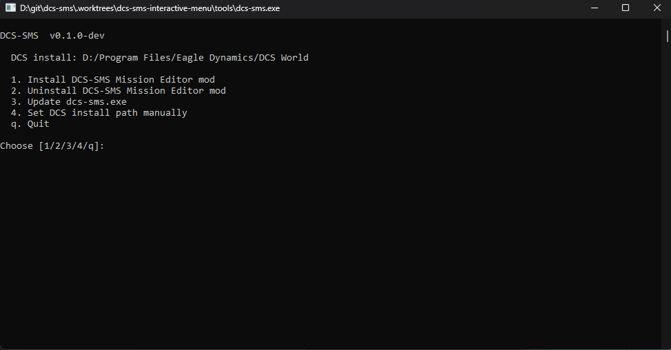

<p align="center">
  
</p>

# dcs-sms.exe — host-side CLI

[](https://github.com/nielsvaes/dcs-sms/actions/workflows/release-me-mod.yml)
[](https://discord.gg/8tbdGY45hM)
[](https://ko-fi.com/F1F4PYTO7)

Single Go-built binary that installs both the framework hook and the ME-mod, executes Lua snippets in a running DCS mission, and generates the framework's data catalogs.

## Audience

Anyone using either the framework or the ME-mod. Both rely on `dcs-sms.exe` as the install / interaction tool.

## Just want to install the ME-mod?

**Double-click `dcs-sms.exe`.** A small menu opens with Install / Uninstall / Update / Set DCS path. Type `1` and press Enter to install.

<p align="center">
  
</p>

The CLI subcommands below are for everything else (the bridge, `gen-units`, scripted use), and remain the way to drive `dcs-sms.exe` from a terminal or CI.

## Install

**Recommended:** download `dcs-sms.exe` from the latest [Release](https://github.com/nielsvaes/dcs-sms/releases). The binary is self-contained — no Go toolchain needed at runtime.

**From source:**

```sh
cd tools
go build ./cmd/dcs-sms
```

Produces `tools/dcs-sms.exe` (Windows) or `tools/dcs-sms` (Linux/macOS — supported for the bridge subcommands; the ME-mod installer is Windows-only because DCS only ships on Windows).

## Required setup for bridge subcommands

The bridge (`exec`, `status`, `tail-log`) relies on the Lua hook running inside DCS. The hook needs filesystem access to scan its inbox and write responses, which DCS sandboxes by default.

Edit `Scripts\MissionScripting.lua` in your DCS *install* directory (not Saved Games) and comment out the `os` / `io` / `lfs` sanitizers:

```lua
do
  -- sanitizeModule('os')
  -- sanitizeModule('io')
  -- sanitizeModule('lfs')
  ...
end
```

This is the same modification `dcs_code_injector` requires. The `install-me-mod` and `gen-units` subcommands do not need this edit; only the bridge subcommands do.

## Subcommands

### Bridge — host ↔ running DCS mission

#### `install-hook`

Writes `dcs-sms-hook.lua` into `<Saved Games>\DCS*\Scripts\Hooks` (auto-detected, or pass `--saved-games <path>` to override). Run once after installing or updating the binary.

```sh
dcs-sms.exe install-hook
```

#### `status`

Reports whether the hook is loaded and a mission is running. Exit 0 if everything is healthy.

```sh
dcs-sms.exe status
# mission loaded: true
# fresh: true
# theatre: Caucasus
```

#### `exec`

Runs a Lua snippet inside the current mission. `--code` for inline, `--file` to send a script file. Returns JSON with `ok`, `return_value`, captured `print` output, and any error.

```sh
dcs-sms.exe exec --code "return 1+1"
dcs-sms.exe exec --file framework/load_all.lua
```

`--timeout 2s` caps wait time. **Note:** if the snippet hangs DCS (e.g. infinite loop), the timeout will return but DCS itself needs to be killed via Task Manager. This is a documented limitation.

##### `--target mission|gui|auto`

`exec` defaults to `--target auto`, which routes based on the hook's heartbeat:

- If a mission is running → `target=mission` (snippet runs in the mission scripting env, sandboxed).
- If the user is in the Mission Editor or main menu → `target=gui` (snippet runs in the shared GUI/ME Lua state and can read/write the editable mission). Requires the ME-mod's "External execution" toggle to be on.

Pass `--target mission` or `--target gui` explicitly to override. Exit code `4` means the requested target isn't usable right now (e.g. `--target gui` while the ME-mod toggle is off).

```sh
# Auto-routed (recommended for most uses)
dcs-sms.exe exec --code "return _VERSION"

# Force the mission scripting env (will fail outside a running mission)
dcs-sms.exe exec --target mission --code "return Unit.getByName('Tanker-1'):getName()"

# Force the GUI/ME state (read the editable mission's theatre)
dcs-sms.exe exec --target gui --code "return mission.theatre"
```

#### `tail-log`

Prints the last N lines of `dcs.log` (default 50).

```sh
dcs-sms.exe tail-log -n 20
```

### ME-mod — install / uninstall the Mission Editor extension

#### `install-me-mod`

Patches `MissionEditor.lua` and copies the mod files. See [`tools/me-mod/README.md`](../../me-mod/README.md) for full install behaviour.

```sh
dcs-sms.exe install-me-mod --dcs-path "D:\Program Files\Eagle Dynamics\DCS World"
```

`--dcs-path` is cached to `%AppData%\dcs-sms\config.toml` on first use; subsequent runs don't need it.

#### `uninstall-me-mod`

Reverses the install — removes the patch block, deletes the modules directory, deletes the backup.

```sh
dcs-sms.exe uninstall-me-mod
```

### AI agent skills — teach Claude / Codex / Gemini about the CLI

#### `install-ai-skill`

Drops a small "skill" file into your AI agent's user-level config directory so
the agent learns that `dcs-sms.exe` is on PATH and how to drive DCS via it.
Three agents are supported:

- **Claude Code** → `~/.claude/skills/dcs-sms/SKILL.md`
- **OpenAI Codex CLI** → `~/.agents/skills/dcs-sms/SKILL.md`
- **Google Gemini CLI** → `~/.gemini/commands/dcs-sms.toml` + `~/.gemini/skills/dcs-sms/SKILL.md`

```sh
dcs-sms.exe install-ai-skill --agent=claude    # one agent
dcs-sms.exe install-ai-skill --agent=all       # all three at once
dcs-sms.exe uninstall-ai-skill --agent=gemini  # remove
```

The skill is short on purpose — it tells the agent the CLI exists and points
it at `--help` for self-discovery. After install, `/dcs-sms` works as a slash
command on Claude and Gemini; on Codex use `$dcs-sms` or the `/skills`
picker. The agents also auto-activate the skill when you mention DCS work in
plain English.

The interactive menu (double-click `dcs-sms.exe`) exposes the same
operation as option 5.

#### `uninstall-ai-skill`

Reverses the install for the chosen agent (or all of them with `--agent=all`).

```sh
dcs-sms.exe uninstall-ai-skill --agent=claude
```

### Framework data — for contributors

#### `gen-units`

Regenerates the unit / static catalogs (under `framework/constants/`) from `dcs-lua-datamine`. End users don't need to run this; it's a developer tool used when DCS adds or renames units.

```sh
dcs-sms.exe gen-units --datamine-root D:/git/dcs-lua-datamine
```

### Self-update — fetch the latest release in place

#### `update`

Hits the GitHub Releases API, finds the most recent release that ships a `dcs-sms.exe` asset, and replaces this binary in place. The previous binary is renamed to `dcs-sms.exe.old` (harmless; safe to delete manually).

```sh
dcs-sms.exe update
```

After a successful update, run `dcs-sms.exe install-me-mod` to apply the new ME-mod files inside DCS.

#### `update --check`

Reports whether an update is available without downloading or modifying anything. Useful for periodic "is there anything new?" checks.

```sh
dcs-sms.exe update --check
# Up to date (v0.2.0)
#   - or -
# Update available: v0.1.0 → v0.2.0
# Run `dcs-sms.exe update` to install.
```

Self-update is currently Windows-only. Linux/macOS users are expected to rebuild from source via `go build ./cmd/dcs-sms`.

## License

The CLI is licensed under the [GNU General Public License, version 3](../../LICENSE) (covering everything under `tools/`). You may use, modify, and distribute it, but derivative works must also be GPL v3 and ship with source.

The framework (`framework/`) is MIT-licensed separately so mission makers can embed it freely. See [`LICENSE.md`](../../../LICENSE.md) at the repo root for the full rationale.

## Versioning

The CLI binary is bundled with each ME-mod release (`me-mod-v0.x.y` tag). It does not have its own version track. See [`AGENTS.md` §11](../../../AGENTS.md#11-versioning-and-releases).

## Manual smoke checklist

For the release-gate procedure (run before tagging), see [`docs/release-gate/bridge-smoke.md`](../../../docs/release-gate/bridge-smoke.md).
