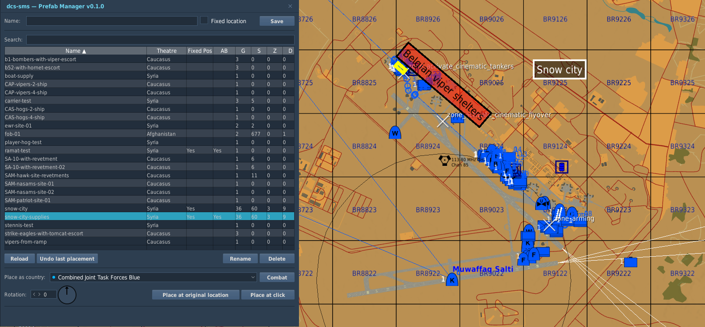
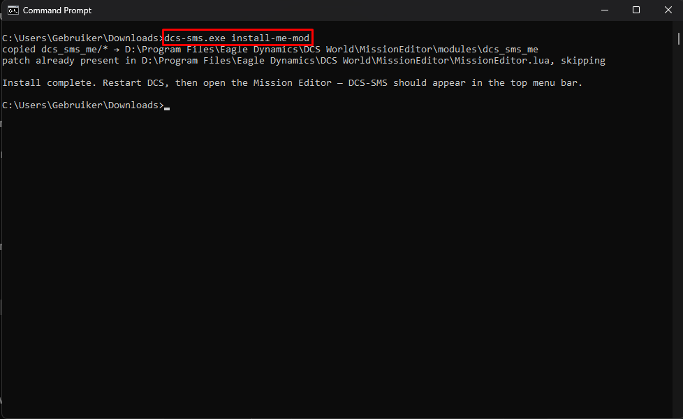
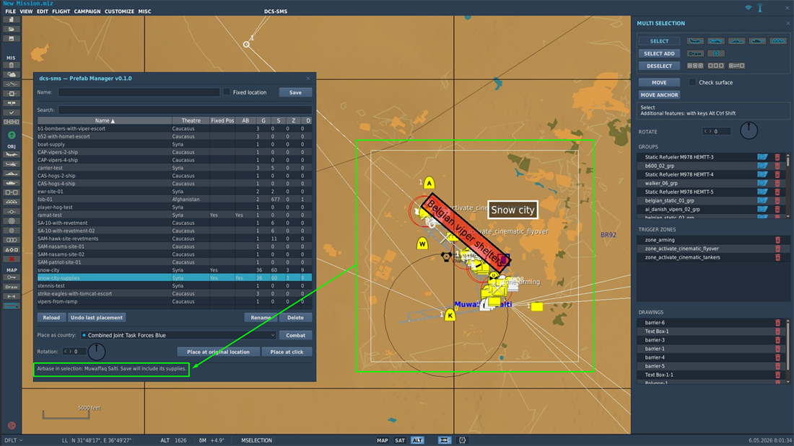
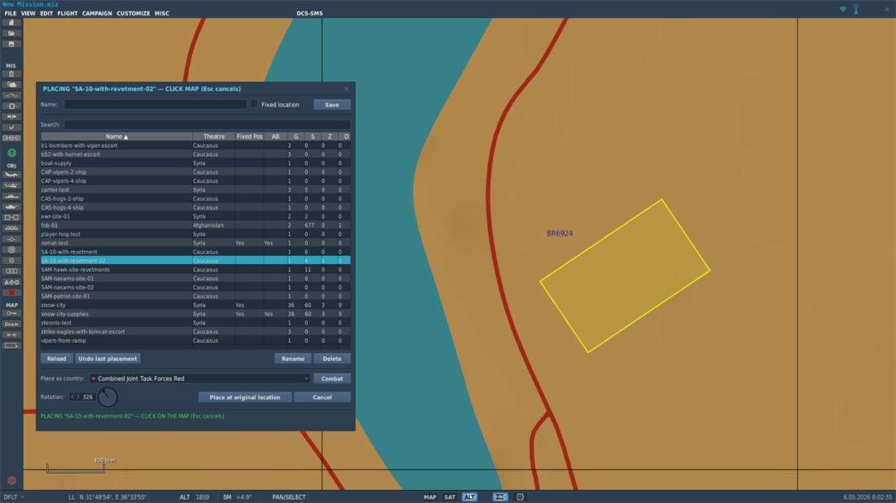
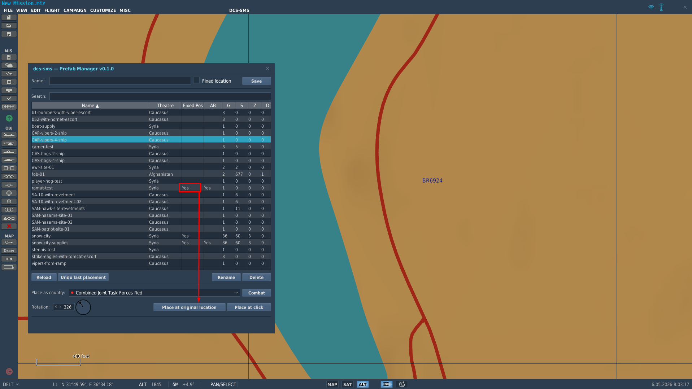
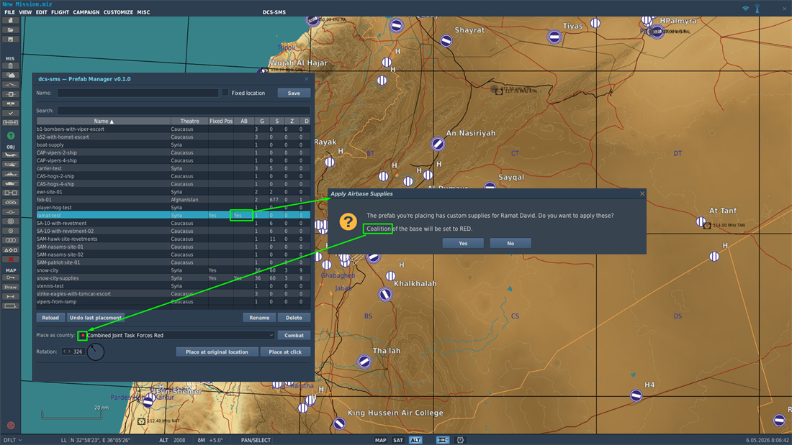

<p align="center">
  
</p>

# dcs-sms — Mission Editor mod

> **🚀 Quick start:**
>
> 1. [**Download `dcs-sms.exe`**](https://github.com/nielsvaes/dcs-sms/releases/latest/download/dcs-sms.exe) — save it anywhere (Downloads is fine).
> 2. Open a **CMD** or **PowerShell** terminal in that folder. (Don't know how? In File Explorer click the address bar, type `cmd`, press Enter.)
> 3. Run: `dcs-sms.exe install-me-mod`
> 4. **Fully quit DCS** (not just the Mission Editor) and start it again.
> 5. Open the Mission Editor — **DCS-SMS** will appear in the top menu bar.
>
> Hit a snag? Jump to [Troubleshooting](#troubleshooting).

Custom in-editor extension that adds a **Prefab Manager** to DCS World's Mission Editor. Save a selection of groups / statics / zones / drawings to a reusable prefab; place them later by click or at their original location. Supports rotation, country override, airbase warehouse capture, per-ship warehouses, and undo.

<p align="center">
  
</p>

## Audience

You design DCS missions in the Mission Editor and want to reuse pieces of one mission in another.

## Install

`dcs-sms.exe` is a command-line tool, not a GUI installer — double-clicking it won't do anything useful. Save it anywhere convenient (Downloads, Desktop, `C:\Tools`, wherever — the .exe doesn't write anything to that folder; it just needs to be where you can run it from). Then open a **CMD** or **PowerShell** terminal in that folder and run:

```powershell
dcs-sms.exe install-me-mod
```

> 💡 Easiest way to open a terminal in a specific folder: in File Explorer, click the address bar, type `cmd`, and press Enter. The terminal opens with that folder as the working directory.

A successful run looks like this:

<p align="center">
  
</p>

> 🛡️ **First-run Windows warning:** `dcs-sms.exe` is unsigned (signing certs cost money this project doesn't have), so Windows / Edge / Chrome may flag it as "unrecognised" on download or first run. Tell the warning to keep going — see [Troubleshooting → SmartScreen](#windows-smartscreen-says-windows-protected-your-pc) for the click path.

That's the whole command. It auto-detects DCS at the standard install path (`C:\Program Files\Eagle Dynamics\DCS World` and similar locations).

If your DCS lives somewhere non-standard, pass `--dcs-path` once — it's cached to `%AppData%\dcs-sms\config.toml`, so subsequent installs/uninstalls don't need the flag again:

```powershell
dcs-sms.exe install-me-mod --dcs-path "D:\Program Files\Eagle Dynamics\DCS World"
```

You can also set the `DCS_SMS_DCS_INSTALL` environment variable instead of the flag.

What this does:

1. Backs up `<DCS>\MissionEditor\MissionEditor.lua` → `MissionEditor.lua.dcs-sms.bak`. Refuses if a backup already exists (run `dcs-sms uninstall-me-mod` first to clean up).
2. Appends a `require('dcs_sms_me.init')` block (delimited by sentinel comments) to `MissionEditor.lua`.
3. Copies the mod files to `<DCS>\MissionEditor\modules\dcs_sms_me\`.

Re-running the install is safe — it re-copies module files, but does not re-patch `MissionEditor.lua` if the markers are already present.

After installing, **restart DCS** (a full restart, not just closing the Mission Editor — Lua files in `MissionEditor.lua` load once at DCS start). Open the Mission Editor; you should see **DCS-SMS** in the top menu bar.

For the binary itself, see [`tools/cmd/dcs-sms/README.md`](../cmd/dcs-sms/README.md).

## Update

When a new ME-mod release ships, [download the new `dcs-sms.exe`](https://github.com/nielsvaes/dcs-sms/releases/latest/download/dcs-sms.exe) and re-run the install command:

```powershell
dcs-sms.exe install-me-mod
```

The patch line in `MissionEditor.lua` stays in place; the Lua files under `MissionEditor/modules/dcs_sms_me/` get overwritten with the new version. Idempotent — re-running install as often as you like is safe.

After updating, **fully quit DCS and start it again** (same reason as install — Lua files load once at DCS start).

## Uninstall

```powershell
dcs-sms.exe uninstall-me-mod
```

Removes the patch block from `MissionEditor.lua` (surgically, by markers; falls back to backup-restore if the markers were edited away), deletes the modules directory, and deletes the backup.

## Troubleshooting

### Windows SmartScreen says "Windows protected your PC"

`dcs-sms.exe` is unsigned, so Windows treats it as suspicious by default. You'll see this in two places:

- **On download** — Edge / Chrome may warn that the file "might be dangerous" or block it. Click **Keep** (Edge) or the **^** menu → **Keep anyway** (Chrome).
- **On first run** — Windows may show a blue dialog titled **"Windows protected your PC"**. Click **More info** (small text in the dialog) → **Run anyway**.

You only have to do this once per binary. Subsequent runs of the same .exe go through silently.

### I ran the .exe and nothing happened

Most likely you double-clicked it. `dcs-sms.exe` is a command-line tool — double-clicking briefly opens and closes a terminal window with the help text and you don't see any output.

Open a terminal *in the folder where you saved the .exe* (File Explorer → click the address bar → type `cmd` → Enter), then run `dcs-sms.exe install-me-mod` from there. The output stays visible until you close the terminal.

### Install said "Install complete" but DCS-SMS isn't in the Mission Editor menu

Almost always: you closed and re-opened the Mission Editor without restarting DCS itself. The patched `MissionEditor.lua` loads exactly once when DCS starts; closing-and-reopening the ME doesn't re-load it.

Quit DCS World entirely (close it from the main menu, or kill it via Steam → right-click DCS → Manage → Stop). Start it again. Open the Mission Editor — the **DCS-SMS** menu should now be there.

### "DCS install path not found"

Auto-detect couldn't find DCS at the standard path. Pass `--dcs-path` once with the full path to your DCS install folder (the one containing `bin/`, `MissionEditor/`, and `Scripts/`):

```powershell
dcs-sms.exe install-me-mod --dcs-path "D:\Program Files\Eagle Dynamics\DCS World"
```

The path is cached to `%AppData%\dcs-sms\config.toml` for next time, so you only need this once.

### Something else broke

Check `<Saved Games>\DCS\Logs\dcs.log` for any `[sms.me]` lines around the time of the issue, then [open a bug report](https://github.com/nielsvaes/dcs-sms/issues/new?template=bug_report.yml) — paste the relevant log lines and the version number from the Prefab Manager title bar.

## Prefab Manager

The mod is one floating window — the **Prefab Manager** — under **Tools → DCS-SMS Prefab Manager** in the editor menu (or a floating button at the top-right on builds where the Tools menu API isn't exposed).

### Saving a prefab

Select what you want to capture (groups, statics, zones, drawings — multi-selection works), type a name in the **Name** field, click **Save**. The prefab is written to:

```
<Saved Games>\DCS\dcs-sms\prefabs\<name>.lua
```

These are plain Lua tables — readable, editable in any text editor, version-controllable.

**Marquee-selecting over an airbase** puts the airbase into the selection too, alongside any groups / zones / drawings inside the rect. This is how you capture airbase customisations (warehouse contents, coalition) into a prefab — there's no other way to add an airbase by clicking it directly.

<p align="center">
  
</p>

### Placing a prefab — two modes

**Place at original location** drops the prefab back at the exact world coordinates it was saved from. Useful when the prefab was saved on this same theatre and you want it back where it was.

**Place at click** enters cursor-following placement. The yellow preview rectangle tracks your mouse; left-click to commit, right-drag to pan the map, mouse-wheel to zoom, Esc to cancel.

<p align="center">
  
</p>

> 💡 **Shortcut:** double-click any row in the library to jump straight into Place-at-click mode for that prefab. Saves the row-then-button click.

Rotation, country override, and the airbase-supplies prompt all happen at place time — set them in the controls before clicking Place.

### Library columns

| Column | Meaning |
|---|---|
| **Name** | The prefab's filename (without `.lua`). Click the header to sort. |
| **Theatre** | The map the prefab was saved on. Place-at-original-location refuses across theatres. |
| **Fixed Pos** | `Yes` if the prefab is meant to live at one specific spot on its theatre (e.g. a SAM site defending a specific airfield). You can still Place-at-click it elsewhere — just know you're going off-script. |
| **AB** | `Yes` if the prefab includes airbase warehouse data (see below). |
| **G** / **S** / **Z** / **D** | Counts of groups / statics / zones / drawings inside. |

The **Fixed Pos** column at a glance:

<p align="center">
  
</p>

### Airbase supplies (AB column)

When a prefab has `Yes` in the **AB** column, it's bundled with custom warehouse data for one or more airbases (coalition, fuel stocks, aircraft inventory, weapons inventory, operating levels). Placing the prefab pops a confirmation asking whether you want to apply those supplies to the destination airbase:

<p align="center">
  
</p>

Apply is refused across theatres (a Caucasus airbase prefab can't be applied on Syria) and the destination airbase's coalition is forced to match the place-time country.

### Other actions

- **Rotation** — dial + spinbox at the bottom-left. Rotation applies to all entities in the prefab together (groups, statics, drawings, zones).
- **Country override** — dropdown with a Combat/All toggle and coalition-coloured dots. Placement is refused if any unit type isn't in the chosen country's catalog (no silent ship-becomes-fast-boat fallbacks).
- **Per-ship warehouses** — captured and applied per-ship through the same airbase-supplies flow.
- **Undo** — `Ctrl-Z` with the Manager window focused undoes the most recent placement (groups, zones, drawings, and airbase splices all restored together).
- **Library** — Reload (rescan disk), Rename, Delete, live name+theatre search, click-to-sort columns.

## Versioning

The ME-mod ships under tags `me-mod-v0.x.y`. The canonical version string lives at [`lua/dcs_sms_me/version.lua`](lua/dcs_sms_me/version.lua). See [`AGENTS.md` §11](../../AGENTS.md#11-versioning-and-releases) for the full rules.

- [`CHANGELOG.md`](../../CHANGELOG.md) — release history; the **ME-mod** section tracks `me-mod-v*` tags.

## Manual smoke checklist

For the release-gate procedure (run before tagging a `me-mod-v*` release), see [`docs/release-gate/me-mod-smoke.md`](../../docs/release-gate/me-mod-smoke.md).
